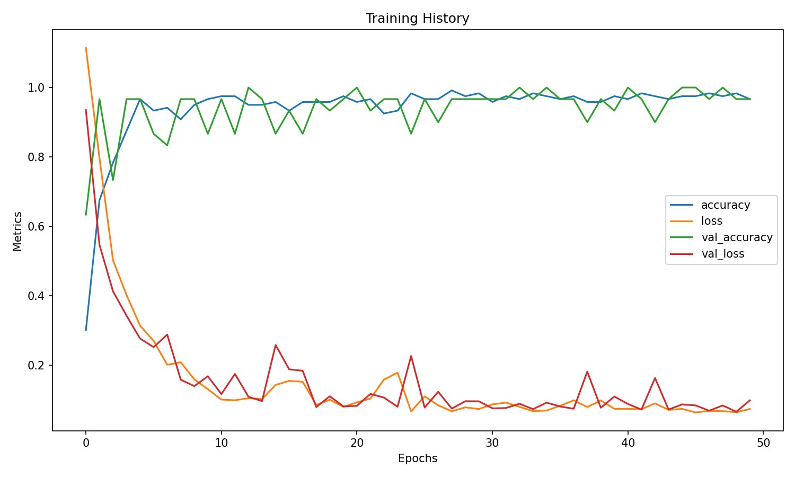
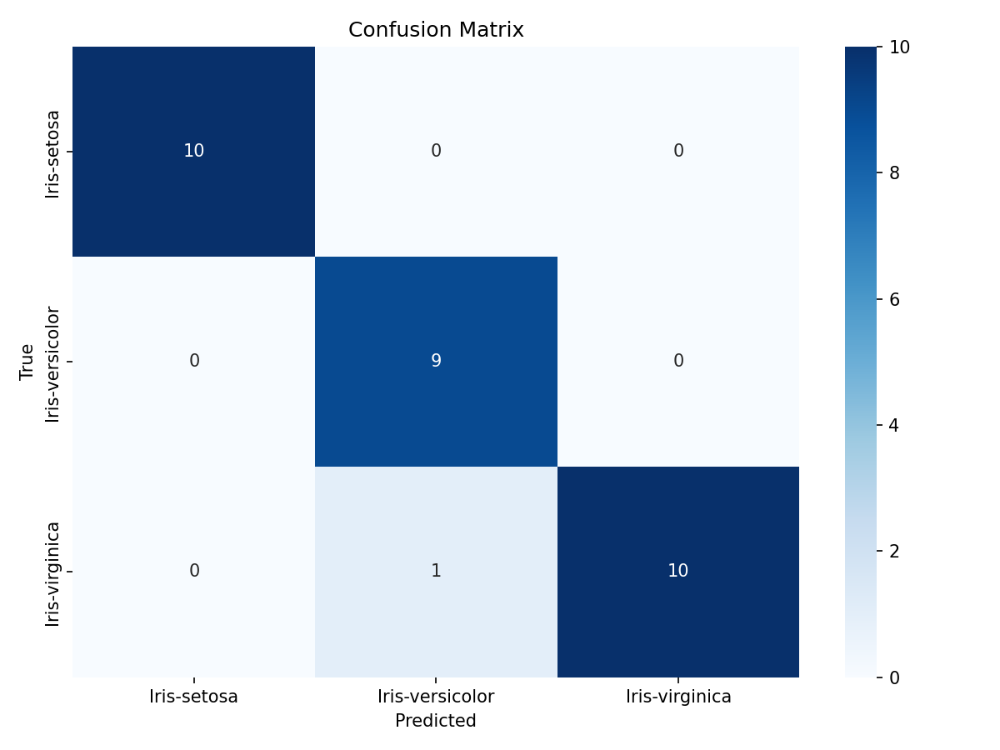

# H1D024026-PraktikumKB-Pertemuan7

## Jaringan Syaraf Tiruan 2 (JST) - Klasifikasi Iris dengan TensorFlow

| Informasi | Detail |
|-----------|--------|
| **Nama** | Muhammad Fathan Ramdani |
| **NIM** | H1D024026 |
| **Shift Awal** | A |
| **Shift Akhir** | B |
| **Pertemuan** | 7 - Jaringan Syaraf Tiruan 2 |

## Deskripsi

Praktikum ini berfokus pada **klasifikasi spesies bunga Iris** menggunakan **Jaringan Syaraf Tiruan (JST)** dengan library **TensorFlow/Keras**. Model yang dibangun dapat mengidentifikasi spesies bunga berdasarkan fitur morfologinya, seperti panjang dan lebar sepal serta panjang dan lebar petal.

### Dataset
- **Dataset Iris** terdiri dari **150 sampel** dengan **4 fitur** dan **1 label kelas**
- Tiga spesies: **Iris Setosa**, **Iris Versicolor**, dan **Iris Virginica**
- Fitur: Sepal Length, Sepal Width, Petal Length, Petal Width

## Arsitektur Model

| Layer | Neuron | Aktivasi |
|-------|--------|----------|
| Input | 4 (fitur) | - |
| Dense 1 | 1000 | ReLU |
| Dense 2 | 500 | ReLU |
| Dense 3 | 300 | ReLU |
| Output | 3 (kelas) | Softmax |

### Konfigurasi Training
- **Optimizer**: Adam
- **Loss Function**: Sparse Categorical Crossentropy
- **Epochs**: 50
- **Batch Size**: 32
- **Split Data**: 80% Training, 20% Testing

## Struktur File

```
iris/
├── Praktikum7.py           # Source code utama
├── iris.data               # Dataset Iris
├── bezdekIris.data         # Dataset Iris (alternatif)
├── iris.names              # Deskripsi dataset
├── training_history.png    # Grafik training history
├── confusion_matrix.png    # Confusion matrix hasil prediksi
└── Index                   # Index file
```

## Fitur Program

1. **Memuat dan memproses dataset** Iris dari file lokal
2. **Konversi label** dari string ke numerik menggunakan LabelEncoder
3. **Pembagian dataset** menjadi training (80%) dan testing (20%)
4. **Membangun model JST** dengan arsitektur Sequential (4 Dense layer)
5. **Kompilasi dan pelatihan model** dengan optimizer Adam
6. **Evaluasi model** menampilkan loss dan accuracy
7. **Visualisasi training history** (grafik loss & accuracy per epoch)
8. **Prediksi pada data testing** dan perbandingan dengan label asli
9. **Confusion Matrix** untuk analisis performa klasifikasi
10. **Prediksi data baru** berdasarkan input pengguna

## Cara Menjalankan

### Prasyarat
```bash
pip install tensorflow pandas numpy scikit-learn matplotlib seaborn
```

### Menjalankan Program
```bash
cd iris
python Praktikum7.py
```

## Hasil Percobaan

### Evaluasi Model

| Metrik | Nilai |
|--------|-------|
| **Accuracy** | **96.67%** |
| **Loss** | **0.0980** |
| **Data Testing** | 30 sampel |
| **Prediksi Benar** | 29 / 30 |

### Hasil Prediksi vs Label Asli

```
Prediksi  : [1 0 2 1 1 0 1 2 1 1 2 0 0 0 0 1 2 1 1 2 0 2 0 2 1 2 2 2 0 0]
Label Asli: [1 0 2 1 1 0 1 2 1 1 2 0 0 0 0 1 2 1 1 2 0 2 0 2 2 2 2 2 0 0]
```
> Keterangan: 0 = Iris-setosa, 1 = Iris-versicolor, 2 = Iris-virginica

### Grafik Training History



### Confusion Matrix



## Library yang Digunakan

| Library | Kegunaan |
|---------|----------|
| TensorFlow/Keras | Membangun dan melatih model JST |
| Pandas | Memuat dan mengelola dataset |
| NumPy | Operasi array numerik |
| Scikit-learn | LabelEncoder, train_test_split, confusion_matrix |
| Matplotlib | Visualisasi grafik training |
| Seaborn | Visualisasi confusion matrix |
